# Agent Deep-Flow: Under the Hood

This guide provides a detailed visual and technical breakdown of the internal sub-steps that an **SDG-compliant AI Agent** executes during each phase of the task cycle.

## Visualizing the Deep Flow

The following diagram illustrates the transitions, decision gates, and loops that ensure architectural integrity.

```mermaid
graph TD
    Trigger((Request)) --> SPEC

    subgraph SPEC [1. SPEC: The Contract]
        S1[Intent Classification] --> S2[Goal Definition]
        S2 --> S3[Domain & Contracts]
        S3 --> S4[Verification Checklist]
        S4 --> S5{Approval Gate}
    end

    S5 -- Approved --> PLAN
    S5 -- Denied --> SPEC

    subgraph PLAN [2. PLAN: The Strategy]
        P1[Task Decomposition] --> P2[Logical Sequencing]
        P2 --> P3[Effort Tagging]
        P3 --> P4[Sub-task Split]
        P4 --> P5[Backlog Sync]
        P5 --> P6{Approval Gate}
    end

    P6 -- Approved --> CODE
    P6 -- Denied --> PLAN

    subgraph CODE [3. CODE: The Execution]
        C1[Context Load] --> C2[Narrative Gate]
        C2 --> C3[Plan Adherence]
        C3 --> C4[Blocker Surface]
    end

    C4 -- Loop / No Progress 3x --> Stop
    C4 --> TEST

    subgraph TEST [4. TEST: The Verification]
        T1[Checklist Verification] --> T2[Regression Proof]
        T2 --> T3{Fix Loop}
        T3 -- Success --> T4[Lint Fix]
        T4 --> T5[Report Status]
    end

    T3 -- Failure (Max 3x) --> CODE
    T3 -- Blocked --> Stop((STOP & Report))

    T5 --> Review{Review Gate}
    Review -- Adjust --> CODE
    Review -- Approved --> END

    subgraph END [5. END: The Delivery]
        E1[Task Summary] --> E2[CHANGELOG or release mode]
        E2 --> E3[Backlog Sync]
        E3 --> E4[Context & Insights]
        E4 --> E5[Final Lint]
        E5 --> E6[Version Bump]
        E6 --> E7[Commit Proposal]
        E7 --> E8{Commit Gate}
    end

    E8 -- Denied --> E7
    E8 -- Approved --> Done((Done))

    style S5 fill:#f96,stroke:#333
    style P6 fill:#f96,stroke:#333
    style T3 fill:#f96,stroke:#333
    style Review fill:#f96,stroke:#333
    style E8 fill:#f96,stroke:#333
    style C4 fill:#ffa,stroke:#333
    style Stop fill:#f66,stroke:#333
```

Click to visualise the Internal Deep-Flow

---

## Detailed Phase Breakdown

### 1. Phase: SPEC

> **Role: Planning** _(Claude Code, multi-agent mode)_

The agent defines **what** to build before thinking about **how**.

- **Intent Identification**: Classification as `land:`, `feat:`, `fix:`, `docs:`, or `audit:`.
- **Goal**: A one-sentence technical "North Star".
- **Verification Checklist**: Up to 5 binary criteria used to validate the final delivery.
- **Approval Gate**: Execution **must stop** here for **Developer verification**.

### 2. Phase: PLAN

> **Role: Planning** _(Claude Code, multi-agent mode)_

The agent sequences the spec into atomic, estimable tasks.

- **Atomic Tasks**: Pattern: `Action Verb + Object`.
- **Effort Tagging**: Tasks are tagged by size: `[S]` (isolated), `[M]` (cross-layer), `[L]` (complex).
- **Sub-task Split**: Any `[L]` task is decomposed into smaller steps (`1.1`, `1.2`).
- **Approval Gate**: Execution **must stop** here to ensure the strategy is sound.

### 3. Phase: CODE

> **Role: Fast** _(Claude Code, multi-agent mode)_

High-density execution following strict architectural standards.

- **Narrative Gate**: Self-check for **Stepdown Rule**, **SLA**, and **Narrative Siblings**.
- **Plan Adherence**: No "bonus" features or refactors (YAGNI).
- **Blocker Surface**: The agent flags issues immediately rather than working around them.
- **Circuit Breaker**: If the same error repeats 3 times, or no physical progress (file writes, commands) is made in 3 consecutive turns, the agent **stops and reports** rather than looping indefinitely.

### 4. Phase: TEST

> **Role: Fast** _(Claude Code, multi-agent mode)_

Verification against the original Spec's checklist.

- **Regression Proof**: For bugs, the agent must prove the fix works without breaking existing logic.
- **Fix Loop**: A built-in resilience mechanism allowing up to **3 refactor attempts** if tests fail. On the third failure, the Circuit Breaker triggers, and the agent stops and reports rather than continuing.
- **Lint Fix**: Automated resolution of style violations before reporting success.
- **Report and stop**: TEST closes with the result per checklist item plus lint and audit status, and the cycle waits there. It does not roll into END on its own.

### The Review Gate, between TEST and END

The third stop, and the one the other two make possible. The developer reads the TEST report and either sends the cycle back to CODE over a FAIL or an open question, or types `end:` to close it. Approving SPEC and PLAN decides what gets built; this gate decides whether what got built ships.

### 5. Phase: END

> **Role: Planning** _(Claude Code, multi-agent mode)_

Closing the loop and ensuring project observability. END opens by confirming the TEST report came back green, then delivers.

- **Artifact Sync**: Finished tasks move to `## Done` in `tasks.md`, and the `## Now` objective in the same file is rewritten or cleared. The objective lived in `context.md` until v5.10.0, one file away from the task list it describes.
- **Knowledge Capture**: Patterns worth reusing go to `.ai/backlog/learned.md`; failures and their resolutions go to `.ai/backlog/troubleshoot.md`. Both are versioned, so the knowledge survives the session that produced it.
- **Changelog**: it depends on the `release` mode declared in `context.md`. On `manual`, one entry per task under `## [Unreleased]`, following the [Keep a Changelog](https://keepachangelog.com/) standard. On `derived`, `CHANGELOG.md` is left alone, because CI generates it from the commit bodies, and writing both produces two sources that drift.
- **Version**: on `manual`, `npm run bump <type>` runs before the commit and the subject carries the number. On `derived`, the commit type is what CI reads to compute the bump. `versioning.md` holds the table.
- **Semantic Commit**: proposing a message that reflects the actual intent and scope, then stopping. The commit itself is **locked** behind explicit developer authorization, and no phase bypasses it.

---

> [!TIP]
> This deep-flow is the internal model the agent follows on every task cycle. Use it to understand why the agent stops where it does and what it checks at each gate.
